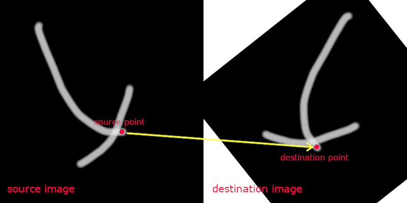

# linkimage

[](https://www.npmjs.com/package/linkimage)

[](https://standardjs.com)
[](https://codecov.io/gh/fralonra/linkimage)

Find corresponding points between images. Using [OpenCV](https://opencv.org/) and [TensorFlow.js](https://www.tensorflow.org/js).



## Install

```bash
npm install linkimage
```

or

```bash
yarn add linkimage
```

## Usage

```javascript
const fs = require('fs')
const { link, linkMat } = require('linkimage')
const { imdecode, imread } = require('opencv4nodejs')

const srcBuffer = fs.readFileSync('images/src.jpg')
const dstBuffer = fs.readFileSync('images/dst.jpg')

// Find point on the destination image which corresponds to the specific point on the source image.
// The source point is the center of the source image.
const point = link(srcBuffer, dstBuffer)
// You can also specify a source point:
// const point = link(srcBuffer, dstBuffer, [100, 100])

// You can also use 'linkMat' method to pass Mat objects directly.
const srcMat = imdecode(srcBuffer)
const dstMat = imdecode(dstBuffer)
// Or use imread instead
// const srcMat = imread('images/src.jpg')
// const dstMat = imread('images/dst.jpg')
const point2 = linkMat(srcMat, dstMat)

// Returns the cordinates of the corresponding point in format [x, y].
// If no point found, return [-1, -1].
console.log(point)
```

## License

[MIT](./LICENSE)